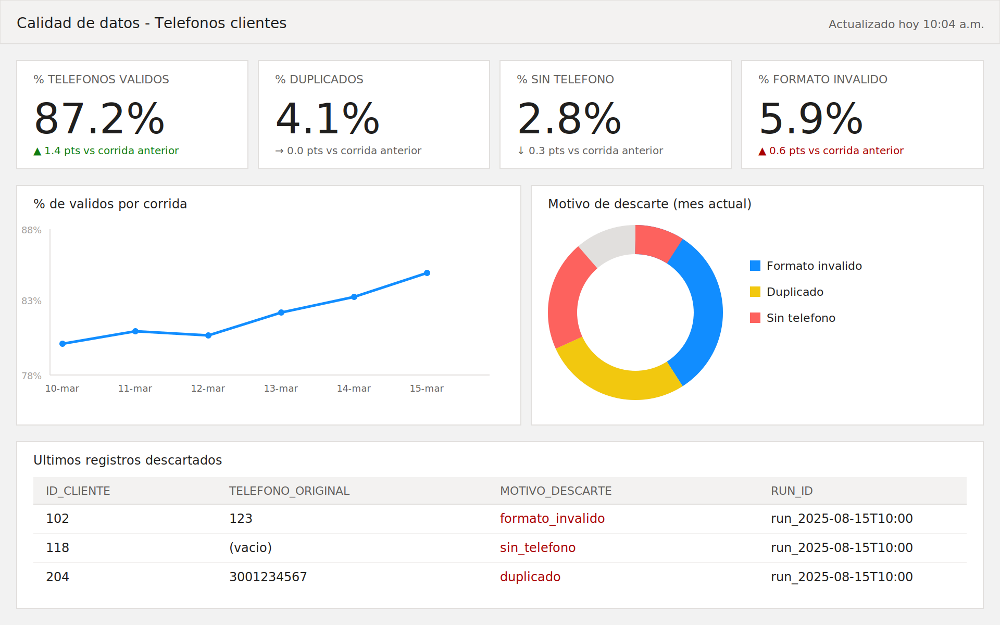

# Ejercicio 2 - KPI's y veeduría de calidad de datos

## El punto de partida

Ahora mismo el pipeline del ejercicio 1 hace su trabajo y ya. Corre,
limpia, guarda el CSV, listo. El problema es que nadie más que yo (o
quien revise los logs de la terminal) sabe qué pasó en esa corrida:
cuántos quedaron, cuántos se cayeron, por qué.

Lo que propongo es que el pipeline, además de generar el dataset limpio,
deje un registro de la corrida. Con eso ya se puede construir todo lo
demás sin tener que inventar infraestructura nueva.

## Qué guardaría por cada corrida

Justo después de que `validate_dataset()` hace su trabajo, guardaría
algo así:

- run_id (o simplemente la fecha/hora)
- cuántos registros entraron
- cuántos quedaron válidos
- cuántos se cayeron por nulos, por duplicados, por formato inválido
- el porcentaje de válidos sobre el total
- de dónde vino el archivo que se procesó

Y aparte, un log más detallado con cada registro que se descartó y el
motivo puntual — eso es lo que le permite a alguien de negocio
preguntar "¿por qué el cliente 102 no quedó en la base?" y tener una
respuesta sin escribirme.

## Con eso ya se pueden sacar los KPI's que le importan a negocio

- % de teléfonos válidos sobre el total de clientes (el número que
  probablemente más les importa)
- tasa de duplicados — si sube mucho, puede ser señal de que el sistema
  de origen está dejando que un cliente se registre dos veces
- tasa de clientes sin ningún teléfono
- cómo se ha movido esto en el tiempo, comparando corridas
- hace cuánto corrió el pipeline por última vez

## Cómo me imagino el dashboard

Algo simple, no hace falta nada sofisticado. Arriba los números clave
de la corrida más reciente (con la variación contra la corrida
anterior), en medio cómo se ha movido el % de válidos en el tiempo y
cómo se reparten los motivos de descarte, y abajo el detalle de qué se
cayó y por qué. Con Metabase, PowerBI o hasta un notebook que se
actualice solo ya se puede montar algo así, apuntando a la tabla de
métricas.

## Cómo conecta con lo que ya existe

El workflow de CI/CD que armamos en el ejercicio 1 ya corre el pipeline
en automático. Ese mismo lugar es donde agregaría el paso de guardar las
métricas — no es algo aparte, es una línea más al final del proceso que
ya existe. Y si un día el porcentaje de válidos cae mucho de un momento
a otro (por ejemplo si algo cambió en el sistema de origen), de ahí
mismo se puede disparar una alerta antes de que ese dataset "malo"
llegue a producción.

La idea de fondo es que la calidad de los datos deje de ser algo que
solo yo puedo ver en la terminal, y se vuelva algo que cualquiera del
equipo de negocio puede consultar cuando quiera.
